# System Architecture

Based on the provided summary of system architecture and decisions.

## Architecture Diagram

```mermaid
graph TD
    %% Actors
    User([Customer])
    Admin([Admin])
    StripeSystem[Stripe Payment System]

    %% External Entry
    subgraph Public_Edge ["Public Edge Layer"]
        DNS[DNS / Cloudflare]
        WAF[WAF / Load Balancer]
        VPN[Admin VPN / Bastion]
    end

    %% Control Plane
    subgraph Control_Plane ["Control Plane (TypeScript Microservices)"]
        direction TB
        APIGW[API Gateway]
        Auth[Auth Service]
        Billing[Billing Service]
        Inventory[Inventory Service]
        Prov[Provisioning Service]
        IPAM[IPAM & DNS Service]
        Template[Template Registry]
        
        %% Data Stores
        SharedDB[(Postgres)]
        SharedCache[(Redis)]
    end

    %% Infrastructure
    subgraph Hetzner_Infra ["Hetzner Infrastructure"]
        direction TB
        
        subgraph Proxmox_Compute ["Proxmox Compute (Independent Nodes)"]
            GameNodes[Game Server Nodes]
            BotNodes[Bot Hosting Nodes]
            CloudNodes[Cloud VM Nodes]
        end
        
        subgraph Bare_Metal ["Bare Metal"]
            BM_Pool[Bare Metal Pool]
        end
        
        subgraph Network_Storage ["Network & Storage"]
            vSwitch[Hetzner vSwitch / VLANs]
            PBS[Proxmox Backup Server]
            Ceph[Optional Ceph]
        end
    end

    %% Observability
    subgraph Observability_Stack ["Observability"]
        Prom[Prometheus]
        Graf[Grafana]
        Loki[Loki / ELK]
        Alert[Alertmanager]
    end

    %% Management / IaC
    subgraph Management ["Management & IaC"]
        TF[Terraform]
    end

    %% Relationships - External Access
    User -->|HTTPS| DNS
    DNS --> WAF
    WAF --> APIGW
    Admin -->|VPN/SSH| VPN
    VPN --> APIGW
    VPN -->|SSH| Hetzner_Infra

    %% Relationships - Control Plane
    APIGW --> Auth
    APIGW --> Billing
    APIGW --> Inventory
    APIGW --> Prov
    APIGW --> IPAM
    APIGW --> Template

    Auth --> SharedDB
    Billing --> SharedDB
    Inventory --> SharedDB
    Prov --> SharedDB
    IPAM --> SharedDB
    Template --> SharedDB
    
    Auth -.-> SharedCache
    Billing -.-> SharedCache
    Prov -.-> SharedCache

    %% Relationships - Billing & Stripe
    Billing <-->|API/Webhooks| StripeSystem
    Billing -->|Trigger Provisioning| Prov

    %% Relationships - Provisioning
    Prov -->|Manage VMs| GameNodes
    Prov -->|Manage VMs| BotNodes
    Prov -->|Manage VMs| CloudNodes
    Prov -->|PXE/Install OS| BM_Pool
    Prov -->|Read State| Inventory
    Inventory -->|Update| BM_Pool

    %% Relationships - Terraform
    TF -->|Provision Hardware| GameNodes
    TF -->|Provision Hardware| BotNodes
    TF -->|Provision Hardware| CloudNodes
    TF -->|Provision Hardware| BM_Pool
    TF -->|Configure| vSwitch
    TF -.->|State Sync| Inventory

    %% Relationships - Observability
    Prom -->|Scrape Metrics| Control_Plane
    Prom -->|Scrape Metrics| Hetzner_Infra
    Hetzner_Infra -->|Logs| Loki
    Control_Plane -->|Logs| Loki
    Prom --> Alert
    Graf --> Prom
    Graf --> Loki

    %% Styling
    classDef plain fill:#fff,stroke:#333,stroke-width:1px;
    classDef db fill:#e1f5fe,stroke:#01579b,stroke-width:2px;
    classDef ext fill:#f3e5f5,stroke:#4a148c,stroke-width:2px;
    classDef infra fill:#e8f5e9,stroke:#1b5e20,stroke-width:2px;
    
    class SharedDB,SharedCache,PBS,Ceph db;
    class User,Admin,StripeSystem ext;
    class GameNodes,BotNodes,CloudNodes,BM_Pool infra;
```

## Summary of Decisions

### 1. Core Technology
- **Control Plane**: TypeScript-first microservices, Next.js for dashboards.
- **Database**: Postgres (Transactional), Redis (Caching/Queues).
- **Billing**: Stripe.

### 2. Infrastructure (Hetzner)
- **Virtualization**: Proxmox (Game, Bot, Cloud).
- **Bare Metal**: Dedicated pool for provisioning.
- **Networking**: Hetzner vSwitch, Public IPs, Private LANs.

### 3. Architecture Layers
- **Public Edge**: DNS, WAF.
- **Control Plane**: API Gateway, Auth, Billing, Inventory, Provisioning, IPAM, Template Registry.
- **Compute**: Independent Proxmox nodes (No HA/Corosync), Bare Metal.
- **Observability**: Prometheus, Grafana, Loki/ELK.

### 4. Terraform vs Control Plane
- **Terraform**: Manages physical infrastructure (Nodes, Networking, DNS). *Does NOT manage customer workloads or OS installation.*
- **Control Plane**: Manages customer workloads, VM creation, Bare metal OS installation (PXE), Lifecycle.

### 5. Proxmox Design
- **Decision**: Use **Independent Nodes** (No Clustering/HA).
- **Reason**: Hetzner vSwitch latency is too high/unstable for Corosync (<0.2ms required).
- **Orchestration**: Handled by the TypeScript Control Plane.
